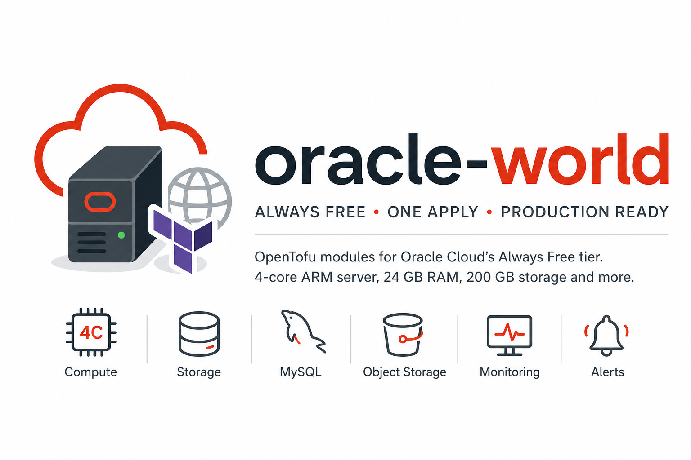
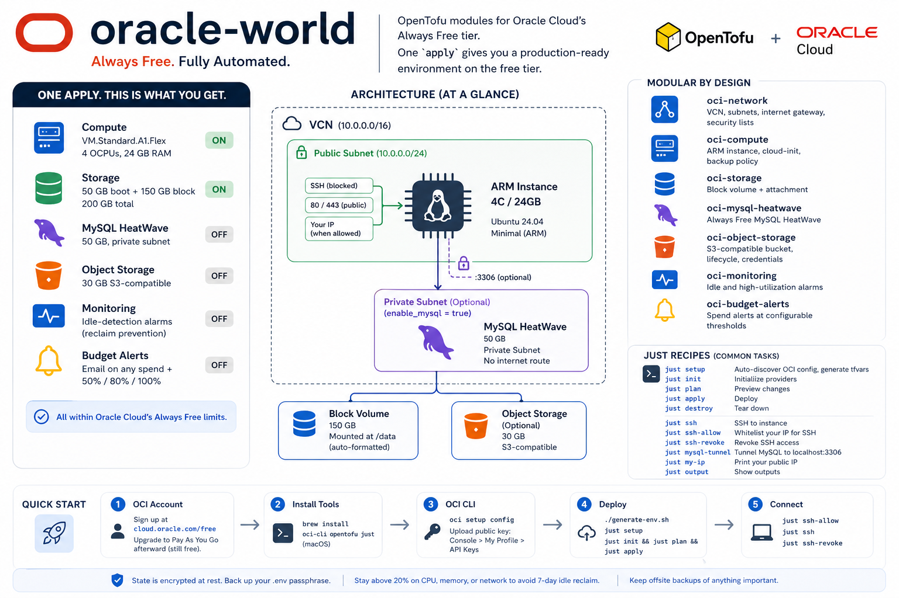

# oracle-world

OpenTofu modules for Oracle Cloud's [Always Free tier](https://docs.oracle.com/en-us/iaas/Content/FreeTier/freetier_topic-Always_Free_Resources.htm). One `apply` gives you a 4-core ARM box with 24 GB RAM, 200 GB storage, and optional MySQL, S3 storage, monitoring, and budget alerts.

| Resource | Spec | Default |
|----------|------|---------|
| Compute | VM.Standard.A1.Flex — 4 OCPUs, 24 GB RAM | On |
| Boot Storage | 50 GB + weekly backups | On |
| Block Storage | 150 GB at `/data` | On |
| MySQL HeatWave | 50 GB, private subnet | Off |
| Object Storage | 30 GB S3-compatible | Off |
| Monitoring | Idle-detection alarms (reclaim prevention) | Off |
| Budget Alerts | Email on any spend + at 50% / 80% / 100% | Off |

## Quick Start

### With Claude Code

```
/setup
```

Walks you through everything interactively.

### Manual

**1. OCI account** — Sign up at [cloud.oracle.com/free](https://cloud.oracle.com/free). Pick your Home Region carefully (can't change it). Upgrade to Pay As You Go afterward — still free, but avoids ARM capacity limits on trial accounts.

**2. Tools**

```bash
brew install oci-cli opentofu just   # macOS
```

**3. OCI CLI**

```bash
oci setup config
```

Upload the generated public key: OCI Console > My Profile > API Keys.

**4. Deploy**

```bash
./generate-env.sh    # random passphrase for state encryption — back this up
just setup           # auto-discovers OCI config, generates tfvars
just init && just plan && just apply
```

**5. Connect**

```bash
just ssh-allow       # whitelist your IP for SSH
just ssh             # connect
just ssh-revoke      # close SSH when done
```

<details>
<summary>Manual setup (without just)</summary>

```bash
./generate-env.sh
cd terraform/environments/oci-prod
cp oci-prod.auto.tfvars.example oci-prod.auto.tfvars
# Fill in: compartment_ocid, user_ocid, availability_domain, ssh_public_key
cd ../../..
just init && just plan && just apply
```

Find these values with:

```bash
grep tenancy ~/.oci/config                                     # compartment_ocid
grep user ~/.oci/config                                        # user_ocid
oci iam availability-domain list --query 'data[0].name' --raw  # availability_domain
cat ~/.ssh/id_ed25519.pub                                      # ssh_public_key
```

</details>

## Configuration

Four required values (compartment, user, availability domain, SSH key). Everything else has defaults:

| Setting | Default | Override |
|---------|---------|----------|
| Compute | 4 OCPUs, 24 GB (ARM) | `ocpus`, `memory_in_gbs` |
| OS | Ubuntu 24.04 Minimal aarch64 | `operating_system`, `os_version` |
| Storage | 50 GB boot + 150 GB block | `boot_volume_size_gb`, `enable_block_volume` |
| Public access | On (ports 80, 443) | `enable_public_access = false` |
| SSH | Blocked | `just ssh-allow` |
| MySQL | Off | `enable_mysql = true` |
| Object Storage | Off | `enable_object_storage = true` |
| Idle alerts | Off | `enable_idle_alerts = true` |
| Budget alerts | Off | set `alert_email` |

### Public vs Private

```hcl
enable_public_access = true          # ports 80, 443 open (default)
enable_public_access = false         # SSH only

additional_tcp_ports = [80, 443]     # customize when public
additional_udp_ports = [51820]       # e.g. WireGuard
```

### Idle Instance Reclaim

Oracle reclaims Always Free instances that stay idle for 7 days. All three must hold simultaneously over the window:

- CPU (95th percentile) < 20%
- Memory < 20%
- Network < 20%

Keep at least one metric above 20% and your instance won't be reclaimed. A cron job, a small web server, or any background process is usually enough.

Enable alerts to get warned after ~4 days of low utilization, giving you ~3 days to act:

```hcl
alert_email        = "you@example.com"
enable_idle_alerts = true
```

See [OCI idle instance reclaim docs](https://docs.oracle.com/en-us/iaas/Content/FreeTier/freetier_topic-Always_Free_Resources.htm#compute__idleinstances) for full details.

### Optional Modules

```hcl
enable_mysql          = true   # 50 GB HeatWave, private subnet, SSH tunnel access
enable_object_storage = true   # 30 GB S3-compatible bucket
```

### Storage Layout

The 200 GB free tier is split 50/150 by default. Block volume is auto-formatted and mounted at `/data` via cloud-init.

```hcl
# Alternative: single disk
boot_volume_size_gb = 200
enable_block_volume = false
```

## Architecture



The instance is in a public subnet because OCI NAT gateways aren't free. MySQL (when enabled) goes in a private subnet with no internet route — access it via SSH tunnel.

SSH is blocked by default. Use `just ssh-allow` to whitelist your IP, `just ssh-revoke` to close it.

Cloud-init on first boot opens iptables, hardens SSH, and enables unattended upgrades. Runs once — changes require instance recreation.

## Modules

| Module | What it does |
|--------|-------------|
| `oci-network` | VCN, subnets, internet gateway, security lists |
| `oci-compute` | ARM instance, backup policy |
| `oci-storage` | Block volume + attachment |
| `oci-mysql-heatwave` | Always Free MySQL |
| `oci-object-storage` | S3-compatible bucket, lifecycle, credentials |
| `oci-monitoring` | Idle and high-utilization alarms |
| `oci-budget-alerts` | Spend alerts at configurable thresholds |

## Just Recipes

| Recipe | Description |
|--------|-------------|
| `just setup` | Auto-discover OCI config, generate tfvars |
| `just init` | Initialize providers |
| `just plan` | Preview changes |
| `just apply` | Deploy |
| `just destroy` | Tear down |
| `just fmt` | Format .tf files |
| `just validate` | Validate config |
| `just output` | Show outputs |
| `just ssh` | SSH to instance |
| `just ssh-allow` | Whitelist your IP for SSH |
| `just ssh-revoke` | Revoke SSH access |
| `just mysql-tunnel` | Tunnel MySQL to localhost:3306 |
| `just my-ip` | Print your public IP |

## State

State is encrypted at rest (AES-GCM + PBKDF2). The passphrase lives in `.env`, which is gitignored and loaded by `just` automatically. **Back up `.env`** — losing the passphrase means losing your state.

### Remote Backends

Local state works fine solo but has no locking or offsite backup. Three options for remote:

**OCI Object Storage** (recommended) — S3-compatible, stays in OCI, negligible free tier impact.

```hcl
backend "s3" {
  bucket                      = "terraform-state"
  key                         = "oci-prod/terraform.tfstate"
  region                      = "us-ashburn-1"
  endpoints                   = { s3 = "https://<namespace>.compat.objectstorage.<region>.oraclecloud.com" }
  skip_region_validation      = true
  skip_credentials_validation = true
  skip_requesting_account_id  = true
  skip_metadata_api_check     = true
  use_path_style              = true
}
```

Create the bucket first: `oci os bucket create --name terraform-state --compartment-id <ocid>`

Set `AWS_ACCESS_KEY_ID` and `AWS_SECRET_ACCESS_KEY` in `.env` (Customer Secret Key from OCI Console).

**HCP Terraform** — Free up to 500 resources. Locking, versioning, web UI. `tofu login` + add a `cloud {}` block.

**PostgreSQL** — Self-hosted, built-in locking. Add a `backend "pg"` block.

To migrate: update `main.tf`, run `just init`, follow the prompt.

## Free Tier Limits

| Resource | Limit | Project Default |
|----------|-------|----------------|
| ARM Compute | 4 OCPUs, 24 GB RAM | 4 OCPUs, 24 GB |
| Boot + Block Volume | 200 GB, 5 backups | 50 + 150 GB |
| Object Storage | 10 GB/tier (paid account) | Off |
| MySQL HeatWave | 50 GB data + 50 GB backup | Off |
| Outbound Data | 10 TB/month | — |

[Full reference](https://docs.oracle.com/en-us/iaas/Content/FreeTier/freetier_topic-Always_Free_Resources.htm)

## Backups

Oracle has been known to close free-tier accounts without warning. The boot volume backup policy and `prevent_destroy` rules protect against accidents, but they're inside OCI. If your account goes away, so do your backups.

**Keep offsite copies of anything important.**

## License

[MIT](LICENSE)
